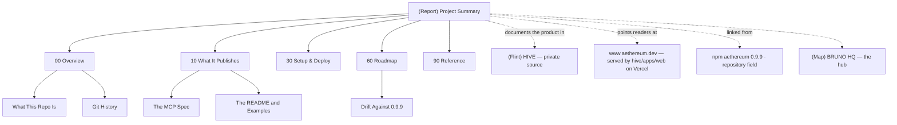

# Master Map — Aethereum Public

The whole vault on one page. **Five sections, 25 authored notes**, for a repo of five files.

## The linked outline

**Entry** — [[(Report) Project Summary]] · [[(System) Flint Init]] · [[(Guide) BRUNO HQ]]

**00 Overview** — [[(Index) 00 Overview]]
[[(Note) What This Repo Is]] · [[(Note) Git History]]

**10 What It Publishes** — [[(Index) 10 What It Publishes]]
[[(Note) The MCP Spec]] · [[(Note) The README and Examples]]

**30 Setup & Deploy** — [[(Index) 30 Setup & Deploy]] — no build, no deploy. The index is the content

**60 Roadmap** — [[(Index) 60 Roadmap]]
[[(Note) Drift Against 0.9.9]]

**90 Reference** — [[(Index) 90 Reference]]

**Reports** — [[(Report) Folder Audit]] · [[(Index) Complete File Inventory]] · [[(Report) Gaps & Questions]] · [[(Report) Build Log]]

**Plumbing** — [[(Index) Sources]] · [[(Note) Media]] · [[(Note) Exports]]

**Shards** — [[(Guide) Shard — Spec Drift Check]] · [[(Guide) Shard — Changelog From Git]] · [[(Guide) Shard — Onboarding Guide]] · [[(Guide) Shard — Vault Audit]]

## Start here if you want to…

| Want to… | Read |
|---|---|
| know what this repo is in 60 seconds | [[(Note) What This Repo Is]] |
| know whether this is the source of `aethereum.dev` | [[(Index) 30 Setup & Deploy]] — **it is not** |
| know if what it says is still true | [[(Note) Drift Against 0.9.9]] |
| read the published MCP tool list | [[(Note) The MCP Spec]] |
| understand the licence position | [[(Note) Git History]] |
| tell `br9704/aethereum` from `br9704/hive` | [[(Index) 90 Reference]] |
| fix the drift | [[(Guide) Shard — Spec Drift Check]] |
| see every file | [[(Index) Complete File Inventory]] |
| know what could not be verified | [[(Report) Gaps & Questions]] |

## Up

[[(Guide) BRUNO HQ]] → `/Users/brunojaamaa/Desktop/Main Vault/Main/Mesh/(Map) BRUNO HQ.md`
