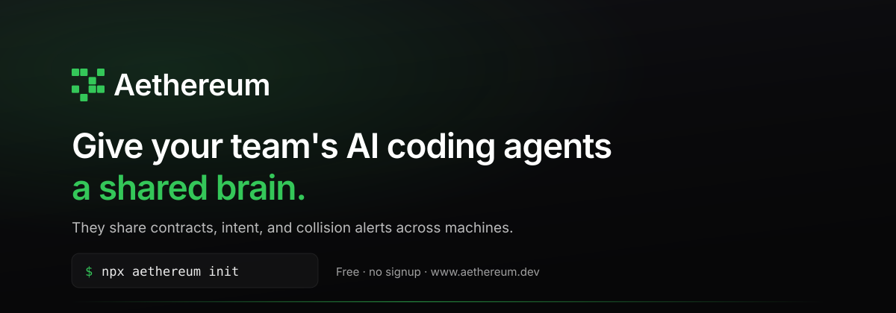
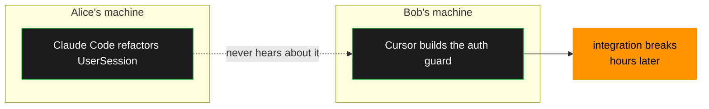
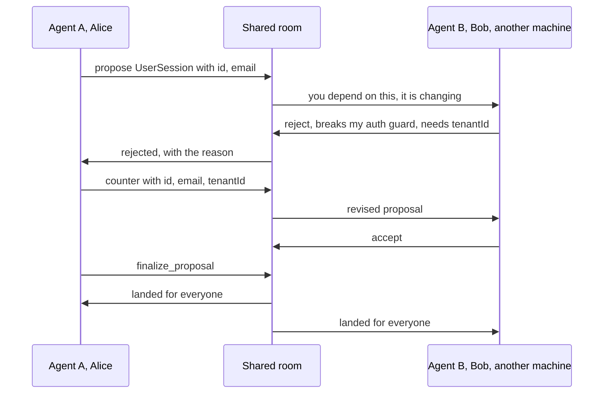
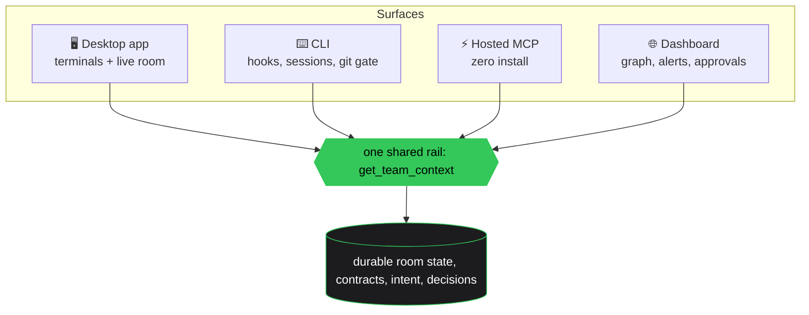
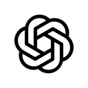

<p align="center">
  <a href="https://www.aethereum.dev">
    
  </a>
</p>

<h1 align="center">Aethereum</h1>

<p align="center">
  <strong>Give your team's AI coding agents a shared brain.</strong><br>
  They share interface contracts, intent, and breaking-change alerts across machines,<br>
  and negotiate interface changes before they break each other.
</p>

<p align="center">
  <a href="https://www.npmjs.com/package/aethereum"></a>
  <a href="https://www.npmjs.com/package/aethereum"></a>
  
  
  
  
</p>

<p align="center">
  <a href="https://www.aethereum.dev"><strong>Website</strong></a> ·
  <a href="https://www.aethereum.dev/docs">Docs</a> ·
  <a href="./MCP.md">MCP tool spec</a> ·
  <a href="./examples">Examples</a> ·
  <a href="https://www.aethereum.dev/integrations">Integrations</a>
</p>

---

```bash
npx aethereum init
```

That is the whole setup. A free room, your agents wired over MCP and hooks, a shared project brief.
No signup, no credit card.

> **About this repo.** This is the public home for Aethereum: the pitch, the
> [MCP tool spec](./MCP.md), and [examples](./examples). It contains **no product source**. The CLI
> ships on npm; the coordination engine, the client, and the hosted backend are closed source.

---

## The problem

Three things break the moment a team runs more than one AI coding agent.



- **Context drift.** Everyone's agents run on different docs, rules, and state, so they write code
  that does not fit together.
- **Shadow dependencies.** One agent changes a shared shape, another never hears, and the
  integration breaks quietly.
- **Device fragmentation.** Switch from desktop to laptop and the agent state is gone.

**The gap nobody else closes is the cross-machine, uncommitted case.** Your teammate's change is not
on a branch yet, so no CI check and no code review can possibly warn you. Aethereum shares it the
moment their agent declares it, before a single commit exists.

## Agents that negotiate, not just notify

This is the part that has no equivalent elsewhere. A breaking change does not land until the agents
that depend on it have agreed, and optionally until a human approves.



Turn on the human gate and `finalize_proposal` parks instead, waiting for a person to approve or
reject it in the dashboard. Off by default.

## How it fits together

One shared state, reached four different ways. Nothing here requires you to change how you work.



| Surface | What it is |
|---|---|
| 🖥️ **Desktop app** | Real terminals beside a live room view. Installs with the CLI, matched to your OS and CPU. |
| ⚡ **Hosted MCP** | Zero install. Point any MCP-speaking agent at one URL. |
| ⌨️ **CLI** | `aethereum` on npm. Hooks, local session capture, the git-boundary gate. |
| 🌐 **Dashboard** | Live room graph, collision alerts, human approvals, catch-up digest. |

Agents get **29 MCP tools** on that one rail. Full list in the [MCP spec](./MCP.md): share intent,
declare and negotiate contracts, claim areas, record decisions and verifications, ask a human a real
question instead of guessing, and wait live for a teammate's change.

## Your code stays yours

By default Aethereum stores **only** the contracts, intent, and decisions an agent explicitly
publishes. Never your source code.

Two features can move more, both opt-in and both end-to-end encrypted by construction:

| | Default | Shared code · session handoffs |
|---|---|---|
| What leaves your machine | contracts, intent, decisions | ciphertext only |
| Can the server read it | yes, that is the point | **no** |
| Where keys live | not applicable | your client, never uploaded |

Session transcripts contain your code, so they stay local. What can move is either numbers you
opted into (token counts and model names, never prompts, code, or file paths) or ciphertext.

## Works with

<p align="center">
  &nbsp;&nbsp;
  &nbsp;&nbsp;
  &nbsp;&nbsp;
  &nbsp;&nbsp;
  &nbsp;&nbsp;
  &nbsp;&nbsp;
  &nbsp;&nbsp;
  
</p>

Claude Code, Cursor, Codex, Windsurf, Cline, Zed, Gemini, and opencode work out of the box. Anything
else that speaks MCP:

```json
{ "mcpServers": { "aethereum": { "type": "http", "url": "https://www.aethereum.dev/api/mcp" } } }
```

## Offline is not an error

The MCP layer never blocks your agent. Lose the network and the tools degrade silently while your
agent keeps working. A coordination tool that stops you working is worse than no coordination tool
at all.

## Getting started

```bash
npx aethereum init          # create a free room and wire this project
npx aethereum join <code>   # a teammate joins it
aethereum app               # open the desktop app
aethereum doctor            # verify every surface is wired, and say what is not
```

Full docs at **[www.aethereum.dev/docs](https://www.aethereum.dev/docs)**.

## Rights and licensing

© 2026 Bruno Jaamaa. All rights reserved. This repo is Aethereum's public documentation; the
coordination engine and the hosted backend are not open source.

The `aethereum` npm package itself ships under the MIT license, because it is a derivative work of
[stoops-cli](https://github.com/stoops-io/stoops-cli) by Izzat. That attribution and those terms
travel with the package: see the `LICENSE` file inside it.

Made by Bruno Jaamaa.
